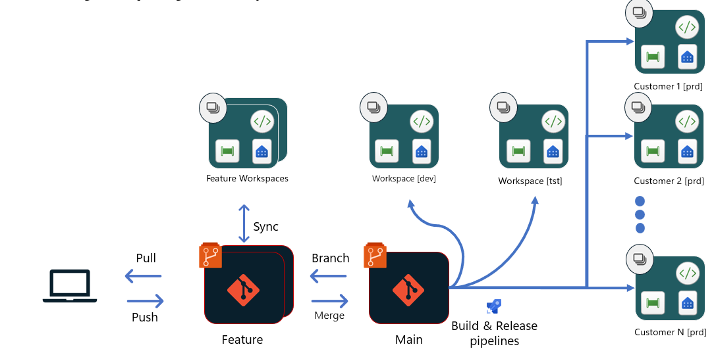

# PBI CI-CD ISV Multi Tenant Sample  

[](https://github.com/alisonpezzott/pbi-ci-cd-isv-multi-tenant/actions/workflows/deploy.yml)[](https://github.com/alisonpezzott/pbi-ci-cd-isv-multi-tenant/actions/workflows/deploy-isv.yml) [](https://github.com/alisonpezzott/pbi-ci-cd-isv-multi-tenant/actions/workflows/bpa.yml)

## What is this?  

This repository is a compilation of various other repositories from Microsoft experts and the community, along with documentation from Microsoft Learn, forums, and articles. It demonstrates the use of a CI/CD scenario for Microsoft Power BI PRO projects by utilizing [fabric-cli](https://aka.ms/fabric-cli) and GitHub Actions.  

The scenario envisions a project where, after deployment, the solution is distributed across multiple tenants—each with its specific data source and user configuration—making it ideal for ISVs (Independent Software Vendors) who build SaaS applications for their customers, as shown in option 4 of the [documentation](https://learn.microsoft.com/en-us/fabric/cicd/manage-deployment).  

  

## Quick Links  
- Sample by Rui Romano: https://github.com/RuiRomano/fabric-cli-powerbi-cicd-sample  
- Sample by Aitor Murguzur: https://github.com/murggu/fab-demos/tree/main/fab-cli-tutorial-lakehouse  
- Choose the best Fabric CI/CD workflow option for you: https://learn.microsoft.com/en-us/fabric/cicd/manage-deployment  
- fabric-cli docs: https://aka.ms/fabric-cli  


## Instalation 

- Fork this repo  
- Configure required GitHub secrets 

|Name|Value|  
|---|---|  
|FABRIC_CLIENT_ID|Service Principal Client ID from Entra App ID|  
|FABRIC_CLIENT_SECRET|Service Principal Secret from Entra App ID|  
|FABRIC_TENANT_ID|Tenant ID|  
|ISV_TENANT_A|FABRIC_CLIENT_ID\|FABRIC_CLIENT_SECRET\|FABRIC_TENANT_ID|  
|ISV_TENANT_B|FABRIC_CLIENT_ID\|FABRIC_CLIENT_SECRET\|FABRIC_TENANT_ID|  
|ISV_TENANT_C|FABRIC_CLIENT_ID\|FABRIC_CLIENT_SECRET\|FABRIC_TENANT_ID|  

If you run locally, configure same secrets on your environment variables and install the `fab-cli` with:  

```bash
$ pip install ms-fabric-cli
```

- Configure  the file `config.json` with ids by branch.  
  - The  adminUPNs are the Object ID of the Entra User Principal Name.  

- Configure the file `config-isv.json` with ids for each tenant.  


## CI/CD Pipeline  

- The PBIP files are saved in the `src` folder with the extensions `*.Report` and `*.SemanticModel`.  
- Deploying new versions is done on the `dev` branch.  
- On every push to `dev`, the GitHub Actions pipeline is triggered, deploying to the `*-DEV` workspace with the name and data source specified in `config.json`.  
- Once the development phase is complete, a pull request is created for the `staging` branch, where the pipeline triggers deployment to the `*-STG` workspace and also runs the best practices analysis pipeline `bpa.yml`. This process utilizes community tools such as [Tabular Editor](https://github.com/TabularEditor/) and [PBI-Inspector](https://github.com/NatVanG/PBI-InspectorV2).    
- Once the project is approved, a pull request is created for the `main` branch, where the pipeline will deploy the version to all tenants specified in `config-isv.json`.  


## Contributing  

- If you would like to help fund or sponsor the project, you can do via [💗 GitHub Sponsors](https://github.com/sponsors/alisonpezzott) or yet via [YouTube](https://youtube.com/@alisonpezzott).  
- This is just one suggested approach in a world of countless possibilities and diverse structures.  
You can and should use this repository as inspiration and a technical foundation to build more sophisticated and robust pipelines if needed for your application. If you are a dev and discover issues or alternative ways, submit your pull requests to apreciation if you wish to contribute with code for the project.  
- Other ways to contribute are by helping people out with support on our forums or in our community. You can access them on the below links.  

[](https://www.youtube.com/@alisonpezzott?sub_confirmation=1)
[](https://github.com/alisonpezzott)
[](https://linkedin.com/in/alisonpezzott)
[](https://discord.gg/sJTDvWz9sM)
[](https://t.me/alisonpezzott)
[](https://instagram.com/alisonpezzott)  


